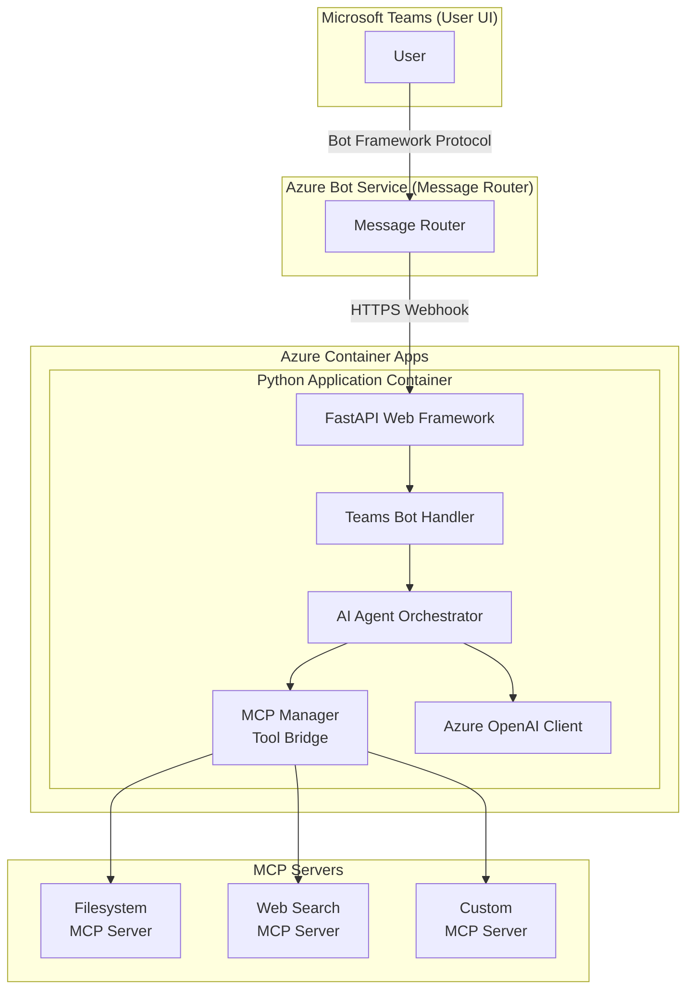
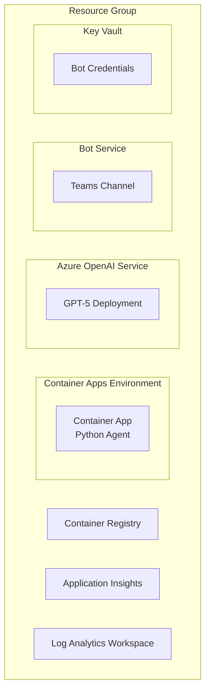
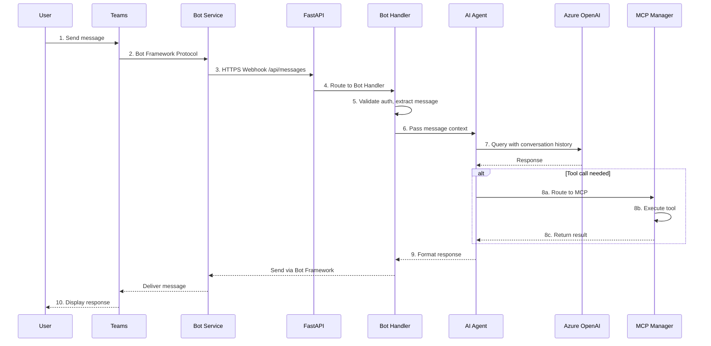
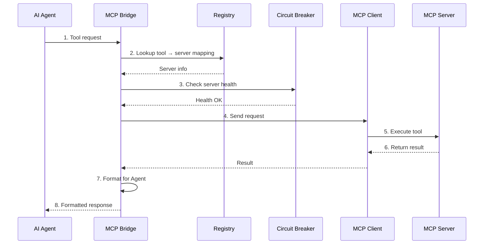
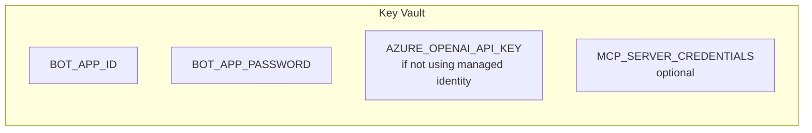
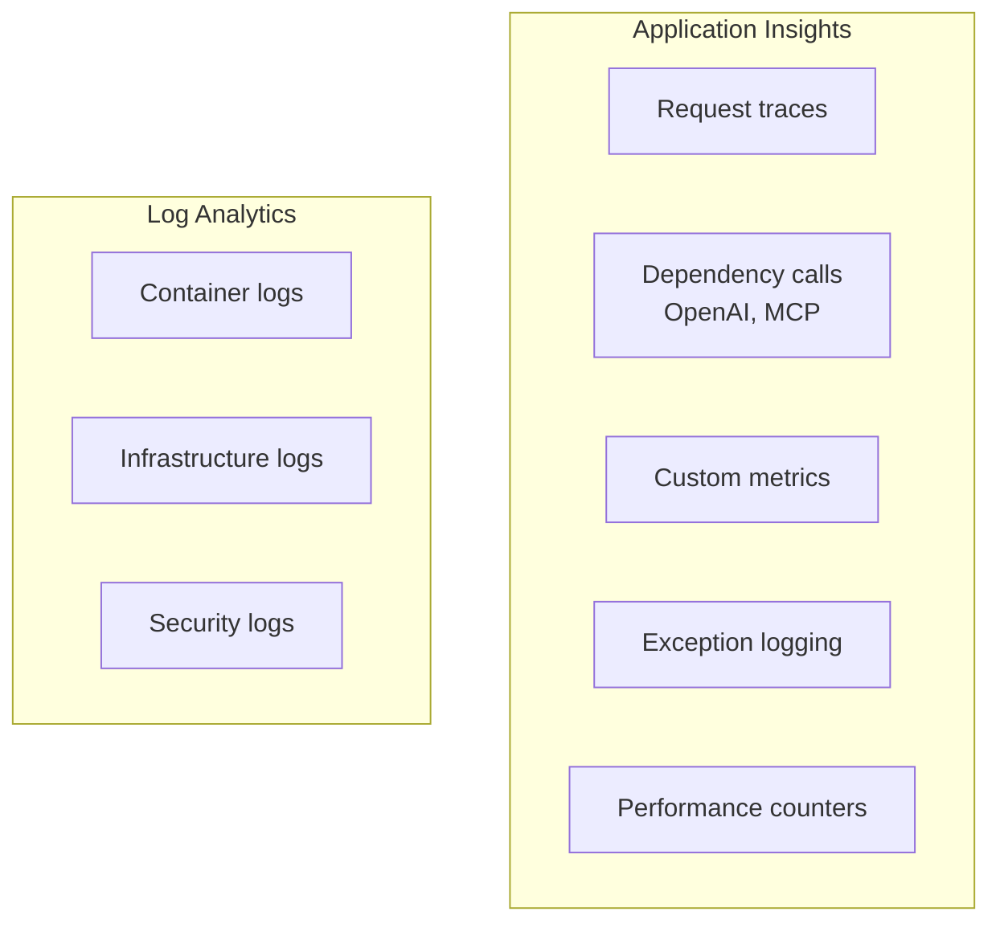
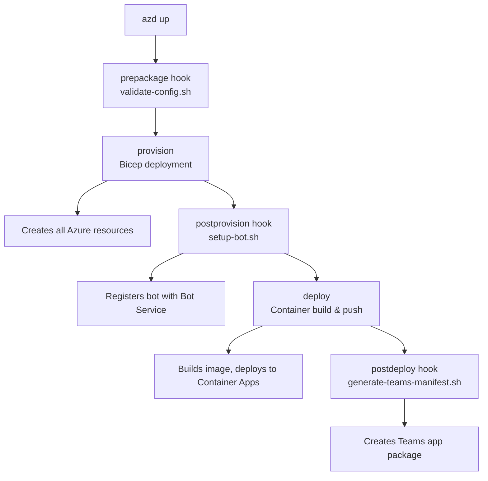
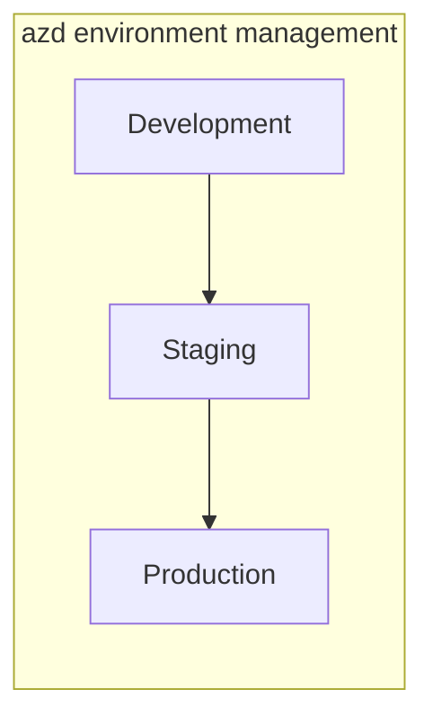

# MS Teams AI Agent - Architecture Documentation

## System Overview

The MS Teams AI Agent is a cloud-native AI assistant that integrates with Microsoft Teams, leveraging Azure OpenAI for intelligent responses and the Model Context Protocol (MCP) for extensible tool capabilities.



## Component Architecture

### 1. Web Layer (`src/app/`)

**FastAPI Application** - Main entry point handling HTTP requests

```text
src/app/
├── main.py              # FastAPI application entrypoint
├── __init__.py          # Package initialization
└── config/
    ├── __init__.py
    └── settings.py      # Pydantic settings management
```

Key responsibilities:

- HTTP request routing
- Health check endpoints (`/health`)
- Bot Framework webhook (`/api/messages`)
- CORS and security middleware

### 2. Bot Layer (`src/app/bot/`)

**Teams Bot Handler** - Processes Bot Framework activities

```text
src/app/bot/
├── __init__.py
├── auth.py              # Bot authentication handling
├── security.py          # Security utilities and validation
├── conversation_state.py # Conversation state management
└── teams_bot.py         # Main bot activity handler
```

Key responsibilities:

- Bot Framework authentication
- Activity type routing (message, typing, etc.)
- Conversation state persistence
- Teams-specific message formatting

### 3. Agent Layer (`src/app/agent/`)

**AI Agent Orchestrator** - Coordinates AI responses

```text
src/app/agent/
├── __init__.py
└── ai_agent.py          # Agent logic and orchestration
```

Key responsibilities:

- Azure OpenAI integration
- Prompt engineering
- Tool call routing to MCP
- Response formatting

### 4. MCP Layer (`src/app/mcp/`)

**Model Context Protocol Integration** - Extensible tool framework

```text
src/app/mcp/
├── __init__.py
├── config.py            # MCP configuration management
├── discovery.py         # Server discovery mechanisms
├── registry.py          # Tool registry
├── tool_schema.py       # Tool schema definitions
├── client.py            # MCP client implementation
├── bridge.py            # Agent-MCP bridge layer
├── factory.py           # Server factory pattern
├── circuit_breaker.py   # Fault tolerance
├── loader.py            # Dynamic server loading
├── exceptions.py        # Custom exception types
├── manager.py           # Server lifecycle management
└── servers/
    ├── __init__.py
    ├── filesystem.py    # Filesystem server adapter
    └── web_search.py    # Web search server adapter
```

Key responsibilities:

- MCP server lifecycle management
- Tool discovery and registration
- Request/response bridging
- Circuit breaker pattern for fault tolerance
- Dynamic server configuration

### 5. Teams Layer (`src/app/teams/`)

**Teams Integration Utilities**

```text
src/app/teams/
├── __init__.py
├── manifest_generator.py  # Teams manifest generation
└── manifest_validator.py  # Manifest validation
```

Key responsibilities:

- Teams app manifest generation
- Manifest schema validation
- Bot capability configuration

### 6. Utilities (`src/app/utils/`)

**Shared Utilities**

```text
src/app/utils/
├── __init__.py
└── teams_helper.py      # Teams-specific helpers
```

## Infrastructure Architecture

### Azure Resources (Bicep)

```text
infra/
├── main.bicep           # Main orchestration template
├── main.parameters.json # Parameter file
├── abbreviations.json   # Resource naming conventions
├── ai/
│   └── openai.bicep     # Azure OpenAI configuration
├── bot/
│   └── bot-service.bicep # Bot Service setup
├── core/
│   └── host/
│       ├── container-app.bicep
│       ├── container-registry.bicep
│       └── container-apps-environment.bicep
└── security/
    └── key-vault.bicep   # Secret management
```

### Resource Topology



## Data Flow

### Message Processing Flow



### MCP Tool Flow



## Security Architecture

### Authentication Layers

1. **Bot Framework Auth**: Microsoft App ID/Password validation
2. **Azure AD**: Managed identity for Azure resources
3. **Key Vault**: Secure secret storage
4. **HTTPS**: TLS encryption for all traffic

### Secret Management



### Network Security

- Container App ingress limited to HTTPS
- Bot Service validates token signatures
- MCP servers run in isolated processes

## Scalability Design

### Container Apps Auto-scaling

```yaml
# Scaling configuration
minReplicas: 1
maxReplicas: 10
rules:
  - name: http-scaling
    http:
      metadata:
        concurrentRequests: 50
```

### Performance Targets

| Metric | Target |
|--------|--------|
| Bot response time | < 2 seconds |
| Health endpoint | < 100ms |
| Concurrent users | 50+ per replica |
| Deployment time | < 15 minutes |

## Monitoring & Observability

### Telemetry Collection



### Key Metrics

- Request duration percentiles (p50, p95, p99)
- Error rates by endpoint
- OpenAI token usage
- MCP server health status
- Container resource utilization

## Deployment Architecture

### azd Workflow



### Environment Promotion



## Extension Points

### Adding New MCP Servers

1. Create server adapter in `src/app/mcp/servers/`
2. Register in `mcp_servers.json`
3. Restart container (auto-discovery)

### Adding New Bot Capabilities

1. Extend `TeamsBot` class in `src/app/bot/teams_bot.py`
2. Add activity handlers for new message types
3. Update Teams manifest with new capabilities

### Adding New AI Models

1. Configure deployment in `infra/ai/openai.bicep`
2. Update agent configuration
3. Redeploy with `azd up`

## Technology Stack

| Component | Technology |
|-----------|------------|
| Runtime | Python 3.11+ |
| Web Framework | FastAPI |
| Bot SDK | botbuilder-python |
| AI | Azure OpenAI (GPT-5) |
| Hosting | Azure Container Apps |
| IaC | Bicep |
| Deployment | Azure Developer CLI (azd) |
| Monitoring | Application Insights |
| Secrets | Azure Key Vault |

---

*Last Updated: 2025-12-01*
*Version: 1.1*
